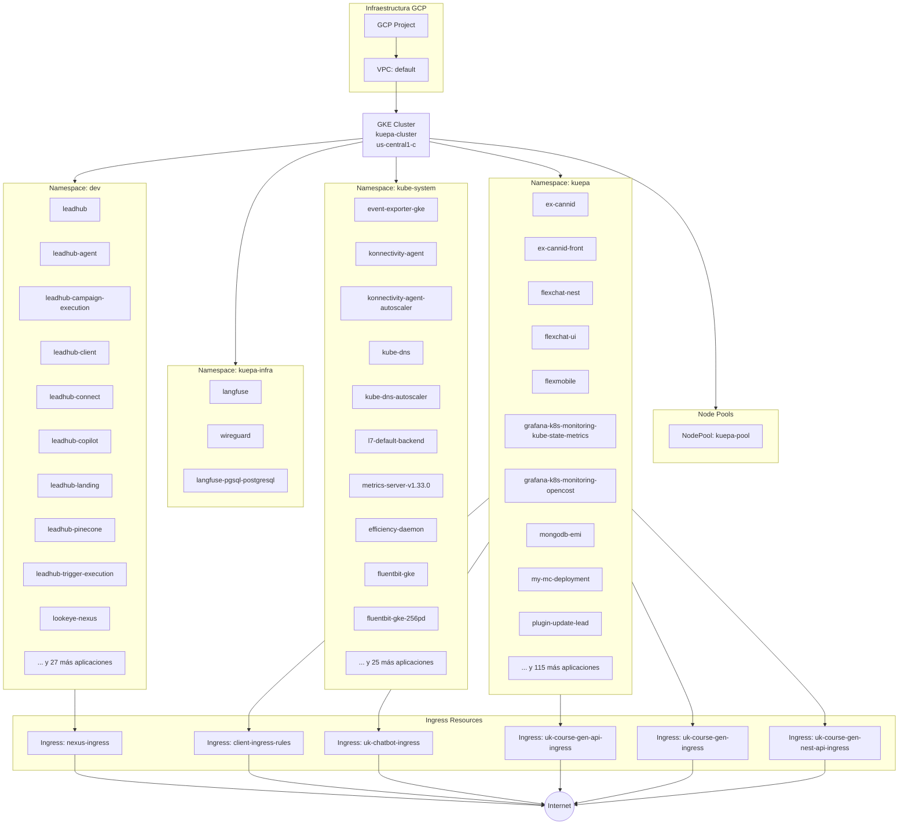

```mermaid
flowchart TB

subgraph INFRA["Infraestructura GCP"]
  GCP["GCP Project"]
  VPC["VPC: default"]
end

CLUSTER["GKE Cluster<br/>kuepa-cluster<br/>us-central1-c"]

GCP --> VPC
VPC --> CLUSTER

subgraph NODES["Node Pools"]
  NP_kuepa_pool["NodePool: kuepa-pool"]
end

CLUSTER --> NODES

subgraph NS_dev["Namespace: dev"]
  APP_dev_leadhub["leadhub"]
  APP_dev_leadhub_agent["leadhub-agent"]
  APP_dev_leadhub_campaign_execution["leadhub-campaign-execution"]
  APP_dev_leadhub_client["leadhub-client"]
  APP_dev_leadhub_connect["leadhub-connect"]
  APP_dev_leadhub_copilot["leadhub-copilot"]
  APP_dev_leadhub_landing["leadhub-landing"]
  APP_dev_leadhub_pinecone["leadhub-pinecone"]
  APP_dev_leadhub_trigger_execution["leadhub-trigger-execution"]
  APP_dev_lookeye_nexus["lookeye-nexus"]
  APP_dev_y_27_m_s_aplicaciones["... y 27 más aplicaciones"]
end

CLUSTER --> NS_dev

subgraph NS_kube_system["Namespace: kube-system"]
  APP_kube_system_event_exporter_gke["event-exporter-gke"]
  APP_kube_system_konnectivity_agent["konnectivity-agent"]
  APP_kube_system_konnectivity_agent_autoscaler["konnectivity-agent-autoscaler"]
  APP_kube_system_kube_dns["kube-dns"]
  APP_kube_system_kube_dns_autoscaler["kube-dns-autoscaler"]
  APP_kube_system_l7_default_backend["l7-default-backend"]
  APP_kube_system_metrics_server_v1_33_0["metrics-server-v1.33.0"]
  APP_kube_system_efficiency_daemon["efficiency-daemon"]
  APP_kube_system_fluentbit_gke["fluentbit-gke"]
  APP_kube_system_fluentbit_gke_256pd["fluentbit-gke-256pd"]
  APP_kube_system_y_25_m_s_aplicaciones["... y 25 más aplicaciones"]
end

CLUSTER --> NS_kube_system

subgraph NS_kuepa_infra["Namespace: kuepa-infra"]
  APP_kuepa_infra_langfuse["langfuse"]
  APP_kuepa_infra_wireguard["wireguard"]
  APP_kuepa_infra_langfuse_pgsql_postgresql["langfuse-pgsql-postgresql"]
end

CLUSTER --> NS_kuepa_infra

subgraph NS_kuepa["Namespace: kuepa"]
  APP_kuepa_ex_cannid["ex-cannid"]
  APP_kuepa_ex_cannid_front["ex-cannid-front"]
  APP_kuepa_flexchat_nest["flexchat-nest"]
  APP_kuepa_flexchat_ui["flexchat-ui"]
  APP_kuepa_flexmobile["flexmobile"]
  APP_kuepa_grafana_k8s_monitoring_kube_state_metrics["grafana-k8s-monitoring-kube-state-metrics"]
  APP_kuepa_grafana_k8s_monitoring_opencost["grafana-k8s-monitoring-opencost"]
  APP_kuepa_mongodb_emi["mongodb-emi"]
  APP_kuepa_my_mc_deployment["my-mc-deployment"]
  APP_kuepa_plugin_update_lead["plugin-update-lead"]
  APP_kuepa_y_115_m_s_aplicaciones["... y 115 más aplicaciones"]
end

CLUSTER --> NS_kuepa

subgraph INGRESS["Ingress Resources"]
  ING_nexus_ingress["Ingress: nexus-ingress"]
  ING_client_ingress_rules["Ingress: client-ingress-rules"]
  ING_uk_chatbot_ingress["Ingress: uk-chatbot-ingress"]
  ING_uk_course_gen_api_ingress["Ingress: uk-course-gen-api-ingress"]
  ING_uk_course_gen_ingress["Ingress: uk-course-gen-ingress"]
  ING_uk_course_gen_nest_api_ingress["Ingress: uk-course-gen-nest-api-ingress"]
end

NS_dev --> ING_nexus_ingress
ING_nexus_ingress --> Internet
NS_kuepa --> ING_client_ingress_rules
ING_client_ingress_rules --> Internet
NS_kuepa --> ING_uk_chatbot_ingress
ING_uk_chatbot_ingress --> Internet
NS_kuepa --> ING_uk_course_gen_api_ingress
ING_uk_course_gen_api_ingress --> Internet
NS_kuepa --> ING_uk_course_gen_ingress
ING_uk_course_gen_ingress --> Internet
NS_kuepa --> ING_uk_course_gen_nest_api_ingress
ING_uk_course_gen_nest_api_ingress --> Internet

Internet((Internet))
```
